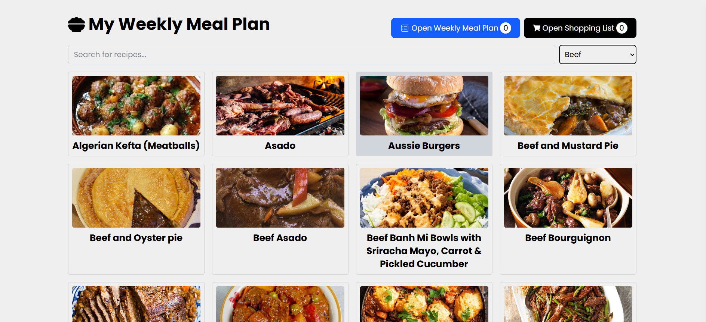
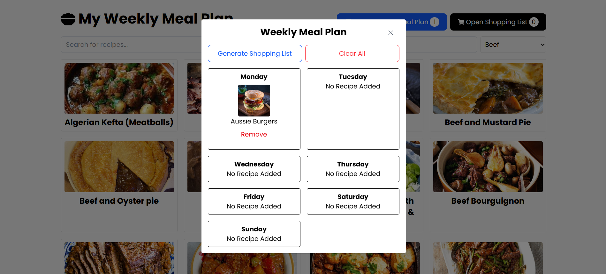
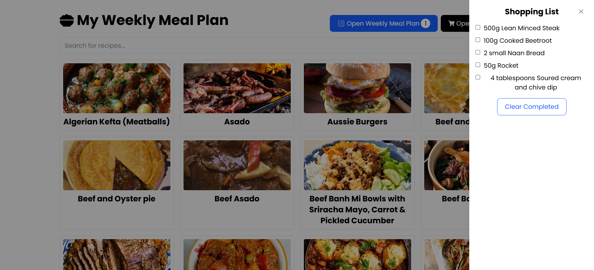
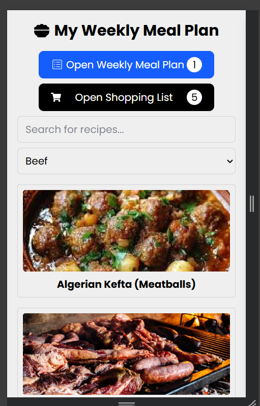

### **Setup Instructions**

```markdown
## Setup & Run

1. Prerequisites (Node version >= 18)
2. git clone https://github.com/your-username/react-meal-planner.git
3. cd my-react-app
4. npm install
```

### **Architecture Overview**

1.

```
src/
   ├── components/ # React components
   ├── hooks/ # Custom hooks (useRecipes, useRecipeDetails, useMealPlan)
   ├── store/ # redux store
   ├── types/ # TypeScript interfaces
   └── App.tsx
```

2. Used redux for modularity and simplification of code.

3. **3 Custom Hooks:**
   1. `useRecipes(searchQuery, category)` - Search/filter recipes
   2. `useRecipeDetails(id)` - Fetch recipe details
   3. `useMealPlan()` - Manage meal planning state

### **Technical Decisions**

1. Chose Atomic structure for components because it is the most practiced one
2. Used Redux for state management.
3. Used React-Icons for icons library
4. If I had more time, maybe add dynamic pages instead of modals for details.

| Task              | Time Spent  |
| ----------------- | ----------- |
| Setup & structure | 1 Hours     |
| Custom hooks      | 1 Hours     |
| State management  | 1 Hours     |
| UI components     | 2 hours     |
| API integration   | 1 hours     |
| Testing & fixes   | 1 hours     |
| **Total**         | **7 hours** |

### **Challenges Faced**

1. Faced Problem during the Vite + TS setup problem because I installed vite only template without TS. That's why during runtime I was facing some type related issues.
2. Reconfigured the tsconfig.json file. That fixed the issue.

ScreenShots

1. 
1. 
1. 
1. 
1. 
